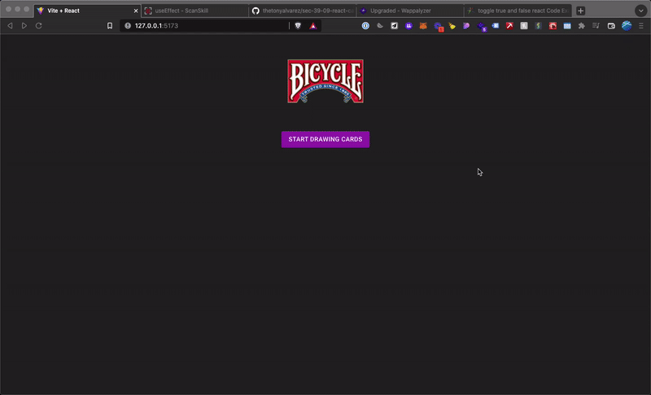

# Draw Cards App

This is a React app that draws one random card from a 52-card deck when you click on the "Start Drawing Cards" button.
If you want to stop, click on "Stop" and the cards will stop drawing.

Once all 52 cards are drawn, the button is disabled.



## Installation and Setup

```bash
npm install
npm run dev
```

## Testing

```bash
npm test
```